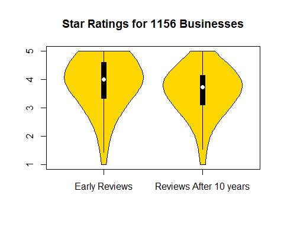
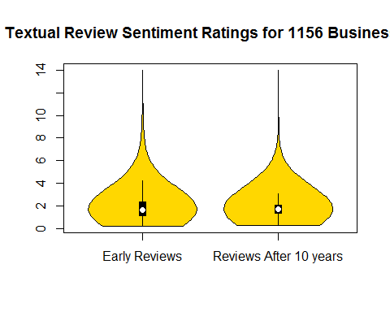

Businesses Regress To The Mean
========================================================
author: Ravi Shankar
date: November 19, 2015

Introduction
========================================================
Sir Francis Galton compared the heights of parents and children. He found that the heights of the children were more clustered around the mean, as compared to the heights of the parents. This is called 'Regression to the Mean.' 
  
We hypothesized this to be true for businesses: 
- Yelp reviews of businesses for the first 24 months is 'first gen'  
- Yelp reviews of businesses for the last 6 months is 'second gen'  
- Found 1156 such businesses that lasted 10 years 
- Quantiative star and qualitative text ratings were analyzed
- Proven at a statistically significant level of p < 0.001

Methods
========================================================

- Subset yelpreview to get "stars" and "text" reviews dfs
- Subset again to get dfs for first 24 months and last 6 months
- 1156 businesses met this filter (lasted 10 years)
- Find average star ratings for the start and end periods
- For textual reviews: 
      combine reviews for each business for each period
- Use "tm.lexicon.GeneralInquirer" for postive & negative polarity counts
- Find Ratio of the two counts; use as numeric rating based on text reviews
- Order the businesses alphabetically
- Run Paired sample t-test statistic for both types of reviews

Results: T-Test Statistics and Violin Plots of Reviews
========================================================

Mean and SD for first 24 months: 3.90 +/- 0.93

Mean and SD for last 6 months:   3.58 +/- 0.83
***

Mean and SD for first 24 months: 1.97 +/- 1.34

Mean and SD for last 6 months:   1.81 +/- 0.85

Conclusion
========================================================

- Businesses did regress in both mean and sd values after 10 years
- For both quantitative (star) and qualitative (text) ratings. 
- Both pairs were shown to be significantly different at p <0.001
- End reviews were lower in both mean and sd vs start reviews
- Companies can use this to identify the business lifespan   
- Companies can then reinvent themselves to serve customers better. 
